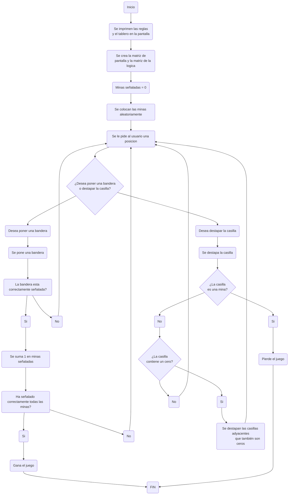

# PROYECTO BUSCAMINAS - GRUPO COD3

# Integrantes:

* David Santiago Hoyos Mateus

* Diego Garcés Torres

# Logo: 

[](https://postimg.cc/yWktQ7nf)

# Alternativa Seleccionada:
La alternativa elegida fue desarrollar un juego de Buscaminas, un juego clasico que consiste en señalar todas las posiciones en un tablero en las que hay minas. Este proyecto fue seleccionado porque ofrece la oportunidad de implementar varios aspectos técnicos clave, como la generación aleatoria de minas, la revelación de celdas y el cálculo preciso de los números adyacentes. Además, implica la creación de una interfaz gráfica que no solo debe ser intuitiva y fácil de usar, sino también visualmente atractiva para el usuario.

Un aspecto particularmente interesante de este proyecto es su potencial para expansión. Se pueden añadir diferentes niveles de dificultad, temporizadores y tableros personalizados, lo que permite convertir este desarrollo en un proyecto mucho más completo y sofisticado. Estas características adicionales no solo aumentan la complejidad del juego, sino que también permiten explorar diversas técnicas de programación y diseño, enriqueciendo aún más la experiencia de desarrollo.


# Lógica (Como se va a desarrollar el programa)
El objetivo del juego de Buscaminas en Python es descubrir todas las casillas del tablero que no contienen minas. Si el jugador selecciona una casilla que tiene una mina, pierde el juego. Cada casilla vacía en el tablero muestra un número que indica cuántas minas están presentes en las ocho casillas adyacentes. Esta información es clave para ayudar al jugador a deducir la ubicación de las minas.

Para comenzar, se crea un tablero con dimensiones específicas, por ejemplo, 10x10. Se colocan aleatoriamente un número fijo de minas en diferentes casillas del tablero. Las casillas que no contienen minas se inicializan como vacías. A continuación, para cada casilla vacía, se calcula cuántas minas hay en las casillas adyacentes. Este conteo se muestra en la casilla correspondiente, proporcionando al jugador datos esenciales para tomar decisiones informadas.

Durante el juego, el jugador selecciona casillas basándose en la información que se revela. Además, tiene la opción de colocar banderas en las casillas donde sospecha que podrían haber minas. Esto le ayuda a evitar seleccionar accidentalmente esas casillas. Cuando el jugador selecciona una casilla con el número 0, el juego revela automáticamente todas las casillas adyacentes con el mismo número 0, extendiendo la revelación hasta encontrar un número mayor.

El jugador gana si coloca correctamente las banderas en todas las minas del tablero. La lógica del juego se maneja mediante un bucle principal que espera la entrada del jugador y actualiza el estado del tablero de acuerdo con las reglas establecidas. Tras cada movimiento, el juego verifica si todas las casillas con minas han sido señaldas correctamente para determinar si el jugador ha ganado. También se comprueba que no se haya revelado una casilla con una mina, lo cual resultaría en la derrota del jugador.

 #### Puntos importantes a tener en cuenta: 

 - Si la casilla destapada es 0, se destapan todas las casillas adyacentes que sean cero.
 - Se gana si se encuentran correctamente las 10 minas.
 - Para que el juego funcione se crean dos matrices, la primera es la que se encuentra en la pantalla, es decir, la que puede ver el usuario. Y la segunda es aquella en la que va a estar toda la logica, los numeros, las minas, etc...
 - Cada vez que se ponga una mina aleatoriamente justo al iniciar el juego, a las casillas adyacentes se les suma 1.
 - Para evitar confusiones con el tablero y facilitar el juego al usuario, las columnas van a estar representadas por numeros con una C (C1, C2, C3...) y las filas por numero con una F (F1, F2, F3...).


# Funciones preliminares

#### Para que crear el programa se utilizaron seis funciones principales en las que esta toda la logica del programa, las cuales son: 

## Funcion matriz_falsa_funcion()
Funcion para crear la matriz 10x10 de la pantalla con sus encabezados, es decir, a la que el usuario va a tener acceso, esta funcion solamente sirve para imprimirla por lo que no tiene ningun efecto en la logica detras de ella.

```python
def matriz_falsa_funcion():
    #Lista con la matriz completa, lista de cada una de las filas y lista con # de columnas
    global matriz_falsa
    matriz_falsa=[]
    filas_matriz_falsa = []
    numero_columnas = ["0","C1", "C2", "C3", "C4", "C5", "C6", "C7", "C8", "C9", "C10"]
    
    #Variables para colocar el # de filas
    numero_filas = 1 
    Booleano_filas = True
    
    matriz_falsa.append(numero_columnas)

    for i in range(10):
        for j in range(10):
            if Booleano_filas == True:
                filas_matriz_falsa.append("F"+(str(numero_filas))) #Se convierte en str para que no se confunda con el numero de minas
            filas_matriz_falsa.append(" ?") #En cada iteracion añade un elemento a la fila
            Booleano_filas = False #Solamente en la 1era iteracion va a colocar el # de la fila
        matriz_falsa.append(filas_matriz_falsa) #En cada iteracion añade una fila a la matriz con los elementos
        filas_matriz_falsa = [] #se vacia para repetir el proceso y no se acumulen las filas
        Booleano_filas = True
        numero_filas += 1
    
    #se imprime de una forma familiar (o como se deberia ver una matriz)
    for i in range(len(matriz_falsa)):
            print(matriz_falsa[i])
```

## Funcion matriz_real_funcion()
Funcion para crear la segunda matriz 10x10 (la de la logica) que es donde van a estar toda la informacion del programa y datos de cada casilla, en base a esta matriz se va a desarrollar todo el programa

```python
def matriz_real_funcion():
    #Lista con la matriz real completa y lista de cada una de las filas
    global matriz_real
    matriz_real=[]
    filas_matriz_real = []
    
    #Aca se crea la matriz de la logica (no se va a imprimir)
    for i in range(10):
        for j in range(10):
            #Por el momento todos los valores van a ser cero
            filas_matriz_real.append(0) 
        #Se agrega la fila de ceros a la matriz
        matriz_real.append(filas_matriz_real)
        #Se reinicia la lista de las filas que se rellenara de ceros otra vez
        filas_matriz_real = []
```

## Funcion colocar_minas()
Funcion para poner las minas en el tablero aleatoriamente, donde cada vez que se coloque una mina, se suma 1 en las casillas adyacentes, asi sucesivamente hasta poner las 10 minas.

```python
def colocar_minas():
    numero_minas = 0

    while numero_minas<10: #10 iteraciones porque se ponen 10 minas
        #numero entero aleatorio entre 0 y 9 (que son las filas y columnas en la matriz real)
        fila_mina = random.randint(0, 9) 
        columna_mina = random.randint(0, 9)

        #Si la posicion aleatoriamente escogida ya tiene una mina, se omite la iteracion
        if matriz_real[fila_mina][columna_mina] == "*":
            continue
        
        #Esta es la posicion de la mina que se representa con un "*"
        matriz_real[fila_mina][columna_mina] = "*" 
        
        #Los dos ciclos for recorren las casillas adyacentes a la mina
        for i in range(fila_mina-1, fila_mina+2):
            for j in range(columna_mina-1, columna_mina+2):
                if 0<=i<10 and 0<=j<10: #Si la posicion esta en el tablero (hay casos donde se pude salir del tablero por el range)
                    #Si la posicion es la mina entonces se omite, sino se suma 1 a los alrededores
                    if matriz_real[i][j] == "*": 
                        continue 
                    #Suma de 1 a los alrededores
                    matriz_real[i][j] = matriz_real[i][j] + 1
        
        #Al final de 1 iteracion completa se suma 1 en el numero de minas
        numero_minas += 1
```

Para entender un poco mas esta funcion, primero hay que entender que la matriz de la logica al principio se ve asi:

[](https://postimg.cc/mcH2sQSW)

Luego de poner la primera mina aleatoriamente y recorrer las casillas adyacentes aumentando 1 se veria algo asi:

[](https://postimg.cc/K1b5LNRJ)

Del mismo modo funciona, sin importar si esta en las esquinas o en las paredes de la matriz

[](https://postimg.cc/gXpwtSbT)

[](https://postimg.cc/YGQPMSVS)

[](https://postimg.cc/Ty0GGCWS)

Ahora al poner la 2da mina aleatoriamente la matriz cambia a esto:

[](https://postimg.cc/34hsyp2G)

Y con una tercera a esto:

[](https://postimg.cc/Jyjw4KHm)

Al terminar de poner las 10 minas aleatoria la matriz logica se ve asi:

[](https://postimg.cc/fJH84PCp)

Evidentemente esto no se muestra al usuario ya que se ven todas las minas, esto unicamente es para la logica del juego, si se ve desde la perspectiva del jugador, el usuario veria el tablero de esta forma:

[](https://postimg.cc/7GMpgJ0R)

## Funcion casillas_adyacentes()
Funcion para que al destapar una casilla con 0, se destapen sus casillas adyacentes.

```python
def casillas_adyacentes(fila_escogida, columna_escogida):
    #Las coordenadas para los movimientos en las 8 direcciones (casillas adyacentes)
    direcciones = [(-1, -1), (-1, 0), (-1, 1), (0, -1), (0, 1), (1, -1), (1, 0), (1, 1)]

    #El if verifica si la posicion ya fue destapada, si es asi no hace nada
    if matriz_falsa[fila_escogida][columna_escogida] != " ?":
        return

    valor_celda_real = matriz_real[fila_escogida-1][columna_escogida-1]

    #Si la celda en la matriz real es 0, se destapa
    if valor_celda_real == 0:
        matriz_falsa[fila_escogida][columna_escogida] = " 0" 
        
        #El ciclo for recorre las celdas adyacentes
        for direccion in direcciones:
            #Se crean 2 variables que son la fila adicional y la columna adicional (con ayuda de las direcciones)
            fila_adicional = fila_escogida + direccion[0]
            columna_adicional = columna_escogida + direccion[1]

            #Aca se verifica si la celda adyacente esta dentro del tablero
            if 1 <= fila_adicional <= 10 and 1 <= columna_adicional <= 10:
                casillas_adyacentes(fila_adicional, columna_adicional)
                        
    #Si es distinto de 0, solo destapamos la celda actual
    else:
        matriz_falsa[fila_escogida][columna_escogida] = f" {valor_celda_real}"
```

## Funcion destapar_celda()
Funcion que sirve para destapar una casilla o señalar una mina en una posicion (Si es mina, el usuario pierde)

```python
def destapar_celda(bandera_o_destapar, fila_escogida, columna_escogida):
    #Se globalizan las variables definidas para trabajar con ellas
    global minas_correctamente_señaladas
    global lista_minas_señaladas

    #Si se escogio señalar mina, entonces se coloca ! en la matriz
    if bandera_o_destapar == "M": 
        #Se coloca "!" como bandera en la matriz falsa
        matriz_falsa[fila_escogida][columna_escogida] = " !"
        """Si la mina esta correctamente señalada (es decir si realmente hay una mina en la celda) y no esta en la lista de minas señaladas entonces 
        se suma 1 en la variable de minas_correctamente_señaladas y se agrega a la lista de minas señaladas para que si el jugador intenta señalar 
        la misma mina no sume otro valor"""
        if matriz_real[fila_escogida-1][columna_escogida-1] == "*" and (fila_escogida, columna_escogida) not in lista_minas_señaladas:
            minas_correctamente_señaladas += 1
            lista_minas_señaladas.append((fila_escogida, columna_escogida))
        
            #Si llega a 10 minas señaladas correctamente gana el juego
            if minas_correctamente_señaladas == 10:
                print("\n--------------------------------------------------------------------------------------------------------")
                print("------------------------HAS SEÑALADO TODAS LAS MINAS CORRECTAMENTE! HAS GANADO!-------------------------")
                print("--------------------------------------------------------------------------------------------------------")
                #Devuelve True por lo que se acaba el ciclo
                return True 
        
        #Despues se muestra la matriz
        for i in range(len(matriz_falsa)):
            print(matriz_falsa[i])

    elif bandera_o_destapar == "D":
        #Se destapa o se muestra la casilla:
        casillas_adyacentes(fila_escogida, columna_escogida)
        #El espacio es para que no se deforme la matriz y los encabezados tengan sentido
        matriz_falsa[fila_escogida][columna_escogida] = (" "+ (str(matriz_real[fila_escogida-1][columna_escogida-1])))
        
        #Despues se muestra la matriz
        for i in range(len(matriz_falsa)):
            print(matriz_falsa[i])

        #Si la posicion escogida tiene una mina, retorna un True y pierde el juego
        if matriz_falsa[fila_escogida][columna_escogida] == " *":
            print("\n--------------------------------------------------------------------------------------------------------")
            print("-----------------------------------HAS PISADO UNA MINA! HAS PERDIDO!------------------------------------")
            print("--------------------------------------------------------------------------------------------------------")
            return True
```

## Funcion ingresar_verificar_posicion()
Funcion que pregunta por la posicion que el usuario desea y verifica que este correctamente escrita para trabajar con ella

```python
def ingresar_verificar_posicion():
    #Se pregunta por la posicion que quiere el usuario
    print('\nIngrese una posicion que desee destapar o señalar como una mina separandolo con "-": ("M" para señalar mina o "D" para destapar, ej: M-5-4, D-9-1, M-10-8)')
    
    #Ciclo que se rompe hasta que la posicion sea correcta
    while True:
        usuario_posicion = str(input("Ingrese posicion: "))
        usuario_posicion = usuario_posicion.upper() #La cadena se tranforma con .upper() para una condicion especifica
        lista_usuario_posicion = usuario_posicion.split("-") #Se crea una lista separando los elementos mediante el "-"
        
        #A continuacion se evaluan ciertas condiciones para verificar que la posicion es correcta y para evitar errores
        if "-" not in usuario_posicion:
            print('\nEn la cadena no ingreso el separador "-"')
            continue

        if len(lista_usuario_posicion) != 3:
            print("\nIngreso una posicion incorrecta (no tiene 3 caracteres), intente de nuevo: ")
            continue
    
        if lista_usuario_posicion[0] != "M" and lista_usuario_posicion[0] != "D":
            print('\nIngreso una posicion incorrecta (el primer caracter tiene que ser "M"o "D"), intente de nuevo: ')
            continue
        
        #Lista para la condicion
        lista_numeros = ["1", "2", "3", "4", "5", "6", "7", "8", "9", "10"] 
        
        if (lista_usuario_posicion[1] not in lista_numeros) or (lista_usuario_posicion[2] not in lista_numeros):
            print("\nIngreso una posicion incorrecta (la fila o columna esta incorrecta), intente de nuevo: ")
            continue
        
        #Cuando no entra en ningun if, la posicion es correcta y puede salir del bucle
        break
    
    #Se transforman en enteros los numeros de la fila y la columna para trabajar con ellos
    int(lista_usuario_posicion[1])
    int(lista_usuario_posicion[2])

    #En el return esta la letra ("M" o "D") y la fila y la columna
    return lista_usuario_posicion[0], lista_usuario_posicion[1], lista_usuario_posicion[2]
```

# Programa preliminar
En esta seccion se muestra todo el programa preliminar teniendo las funciones previamente descritas e incorporando la funcion main, tambien se importa la libreria random para colocar las minas

```python
import random
#Se importa random para colocar las minas aleatoriamente

def matriz_falsa_funcion():
    #Lista con la matriz completa, lista de cada una de las filas y lista con # de columnas
    global matriz_falsa
    matriz_falsa=[]
    filas_matriz_falsa = []
    numero_columnas = ["0","C1", "C2", "C3", "C4", "C5", "C6", "C7", "C8", "C9", "C10"]
    
    #Variables para colocar el # de filas
    numero_filas = 1 
    Booleano_filas = True
    
    matriz_falsa.append(numero_columnas)

    for i in range(10):
        for j in range(10):
            if Booleano_filas == True:
                filas_matriz_falsa.append("F"+(str(numero_filas))) #Se convierte en str para que no se confunda con el numero de minas
            filas_matriz_falsa.append(" ?") #En cada iteracion añade un elemento a la fila
            Booleano_filas = False #Solamente en la 1era iteracion va a colocar el # de la fila
        matriz_falsa.append(filas_matriz_falsa) #En cada iteracion añade una fila a la matriz con los elementos
        filas_matriz_falsa = [] #se vacia para repetir el proceso y no se acumulen las filas
        Booleano_filas = True
        numero_filas += 1
    
    #se imprime de una forma familiar (o como se deberia ver una matriz)
    for i in range(len(matriz_falsa)):
            print(matriz_falsa[i])

def matriz_real_funcion():
    #Lista con la matriz real completa y lista de cada una de las filas
    global matriz_real
    matriz_real=[]
    filas_matriz_real = []
    
    #Aca se crea la matriz de la logica (no se va a imprimir)
    for i in range(10):
        for j in range(10):
            #Por el momento todos los valores van a ser cero
            filas_matriz_real.append(0) 
        #Se agrega la fila de ceros a la matriz
        matriz_real.append(filas_matriz_real)
        #Se reinicia la lista de las filas que se rellenara de ceros otra vez
        filas_matriz_real = []

def colocar_minas():
    numero_minas = 0

    while numero_minas<10: #10 iteraciones porque se ponen 10 minas
        #numero entero aleatorio entre 0 y 9 (que son las filas y columnas en la matriz real)
        fila_mina = random.randint(0, 9) 
        columna_mina = random.randint(0, 9)

        #Si la posicion aleatoriamente escogida ya tiene una mina, se omite la iteracion
        if matriz_real[fila_mina][columna_mina] == "*":
            continue
        
        #Esta es la posicion de la mina que se representa con un "*"
        matriz_real[fila_mina][columna_mina] = "*" 
        
        #Los dos ciclos for recorren las casillas adyacentes a la mina
        for i in range(fila_mina-1, fila_mina+2):
            for j in range(columna_mina-1, columna_mina+2):
                if 0<=i<10 and 0<=j<10: #Si la posicion esta en el tablero (hay casos donde se pude salir del tablero por el range)
                    #Si la posicion es la mina entonces se omite, sino se suma 1 a los alrededores
                    if matriz_real[i][j] == "*": 
                        continue 
                    #Suma de 1 a los alrededores
                    matriz_real[i][j] = matriz_real[i][j] + 1
        
        #Al final de 1 iteracion completa se suma 1 en el numero de minas
        numero_minas += 1
        
def ingresar_verificar_posicion():
    #Se pregunta por la posicion que quiere el usuario
    print('\nIngrese una posicion que desee destapar o señalar como una mina separandolo con "-": ("M" para señalar mina o "D" para destapar, ej: M-5-4, D-9-1, M-10-8)')
    
    #Ciclo que se rompe hasta que la posicion sea correcta
    while True:
        usuario_posicion = str(input("Ingrese posicion: "))
        usuario_posicion = usuario_posicion.upper() #La cadena se tranforma con .upper() para una condicion especifica
        lista_usuario_posicion = usuario_posicion.split("-") #Se crea una lista separando los elementos mediante el "-"
        
        #A continuacion se evaluan ciertas condiciones para verificar que la posicion es correcta y para evitar errores
        if "-" not in usuario_posicion:
            print('\nEn la cadena no ingreso el separador "-"')
            continue

        if len(lista_usuario_posicion) != 3:
            print("\nIngreso una posicion incorrecta (no tiene 3 caracteres), intente de nuevo: ")
            continue
    
        if lista_usuario_posicion[0] != "M" and lista_usuario_posicion[0] != "D":
            print('\nIngreso una posicion incorrecta (el primer caracter tiene que ser "M"o "D"), intente de nuevo: ')
            continue
        
        #Lista para la condicion
        lista_numeros = ["1", "2", "3", "4", "5", "6", "7", "8", "9", "10"] 
        
        if (lista_usuario_posicion[1] not in lista_numeros) or (lista_usuario_posicion[2] not in lista_numeros):
            print("\nIngreso una posicion incorrecta (la fila o columna esta incorrecta), intente de nuevo: ")
            continue
        
        #Cuando no entra en ningun if, la posicion es correcta y puede salir del bucle
        break
    
    #Se transforman en enteros los numeros de la fila y la columna para trabajar con ellos
    int(lista_usuario_posicion[1])
    int(lista_usuario_posicion[2])

    #En el return esta la letra ("M" o "D") y la fila y la columna
    return lista_usuario_posicion[0], lista_usuario_posicion[1], lista_usuario_posicion[2]


def casillas_adyacentes(fila_escogida, columna_escogida):
    #Las coordenadas para los movimientos en las 8 direcciones (casillas adyacentes)
    direcciones = [(-1, -1), (-1, 0), (-1, 1), (0, -1), (0, 1), (1, -1), (1, 0), (1, 1)]

    #El if verifica si la posicion ya fue destapada
    if matriz_falsa[fila_escogida][columna_escogida] != " ?":
        return
    
    #Si la celda en la matriz real es 0, se destapa
    if matriz_real[fila_escogida-1][columna_escogida-1] == 0:
        matriz_falsa[fila_escogida][columna_escogida] = " 0" 
        
        #El ciclo for recorre las celdas adayacentes
        for direccion in direcciones:
            #Se crean 2 variables que son la fila adicional y la columna adicional (con ayuda de las direcciones)
            fila_adicional = fila_escogida + direccion[0]
            columna_adicional = columna_escogida + direccion[1]

            #Aca se verifica si la celda adyacente esta dentro del tablero
            if 1 <= fila_adicional < 10 and 1 <= columna_adicional < 10:
                if matriz_falsa[fila_adicional][columna_adicional] == " ?":
                    if matriz_real[fila_adicional-1][columna_adicional-1] == 0:
                        #Llamada recursiva si la celda adyacente también es 0
                        casillas_adyacentes(fila_adicional, columna_adicional)
                    else:
                        """# Si no es 0, simplemente mostrar el valor en la matriz visible
                        matriz_falsa[fila_adicional][columna_adicional] = matriz_real[fila_adicional-1][columna_adicional-1]"""
                        if matriz_real[fila_adicional-1][columna_adicional-1] == 1:
                            matriz_falsa[fila_adicional][columna_adicional] = " 1"
                        elif matriz_real[fila_adicional-1][columna_adicional-1] == 2:
                            matriz_falsa[fila_adicional][columna_adicional] = " 2"
                        

    # Si la celda no es 0, se destapa y dependiendo de si es 1 o 2, se muestra en la matriz falsa
    if matriz_real[fila_escogida-1][columna_escogida-1] == 1:
        matriz_falsa[fila_escogida][columna_escogida] = " 1"
        
    elif matriz_real[fila_escogida-1][columna_escogida-1] == 2:
        matriz_falsa[fila_escogida][columna_escogida] = " 2"

def destapar_celda(bandera_o_destapar, fila_escogida, columna_escogida):
    #Se globalizan las variables definidas para trabajar con ellas
    global minas_correctamente_señaladas
    global lista_minas_señaladas

    #Si se escogio señalar mina, entonces se coloca ! en la matriz
    if bandera_o_destapar == "M": 
        #Se coloca "!" como bandera en la matriz falsa
        matriz_falsa[fila_escogida][columna_escogida] = " !"
        """Si la mina esta correctamente señalada (es decir si realmente hay una mina en la celda) y no esta en la lista de minas señaladas entonces 
        se suma 1 en la variable de minas_correctamente_señaladas y se agrega a la lista de minas señaladas para que si el jugador intenta señalar 
        la misma mina no sume otro valor"""
        if matriz_real[fila_escogida-1][columna_escogida-1] == "*" and (fila_escogida, columna_escogida) not in lista_minas_señaladas:
            minas_correctamente_señaladas += 1
            lista_minas_señaladas.append((fila_escogida, columna_escogida))
        
            #Si llega a 10 minas señaladas correctamente gana el juego
            if minas_correctamente_señaladas == 10:
                print("\n--------------------------------------------------------------------------------------------------------")
                print("------------------------HAS SEÑALADO TODAS LAS MINAS CORRECTAMENTE! HAS GANADO!-------------------------")
                print("--------------------------------------------------------------------------------------------------------")
                #Devuelve True por lo que se acaba el ciclo
                return True 
        
        #Despues se muestra la matriz
        for i in range(len(matriz_falsa)):
            print(matriz_falsa[i])

    elif bandera_o_destapar == "D":
        #Se destapa o se muestra la casilla:
        casillas_adyacentes(fila_escogida, columna_escogida)
        #El espacio es para que no se deforme la matriz y los encabezados tengan sentido
        matriz_falsa[fila_escogida][columna_escogida] = (" "+ (str(matriz_real[fila_escogida-1][columna_escogida-1])))
        
        #Despues se muestra la matriz
        for i in range(len(matriz_falsa)):
            print(matriz_falsa[i])

        #Si la posicion escogida tiene una mina, retorna un True y pierde el juego
        if matriz_falsa[fila_escogida][columna_escogida] == " *":
            print("\n--------------------------------------------------------------------------------------------------------")
            print("-----------------------------------HAS PISADO UNA MINA! HAS PERDIDO!------------------------------------")
            print("--------------------------------------------------------------------------------------------------------")
            return True
        
        
if __name__ == "__main__":
    print("--------------------------------------------------------------------------------------------------------")
    print("-----------------------------------------------BUSCAMINAS-----------------------------------------------")
    print("--------------------------------------------------------------------------------------------------------")
    print('\n \
-El juego consiste en destapar todas las casillas seguras o señalar todas las minas\n \
-El numero en una casilla indica el numero de minas alrededor (en todas sus casillas adyacentes)\n \
-Si destapas una casilla que es mina pierdes el juego\n \
-Las minas se pueden señalar o marcar con "banderas"\n') 
    
    #Se inicializan las variables con las que se gana el juego
    minas_correctamente_señaladas = 0
    lista_minas_señaladas = []
    
    #Se crea la matriz falsa y enseguida la matriz de la logica o la matriz real
    matriz_falsa_funcion()
    matriz_real_funcion()
    
    #Aca se colocan las 10 minas en la matriz de la logica
    colocar_minas()

    #Este es el cilo en el que va a estar todo el juego
    while True:
        #Las variables del return se guardan en las variables siguientes:
        bandera_o_destapar, fila_escogida, columna_escogida = ingresar_verificar_posicion() 
        #El return de la funcion se guarda en la variable y si esta es True, es porque gano o perdio, por lo tanto el juego acaba
        Terminar = destapar_celda(bandera_o_destapar, int(fila_escogida), int(columna_escogida))
        if Terminar == True:
            break
        
```

### Algoritmo preliminar


