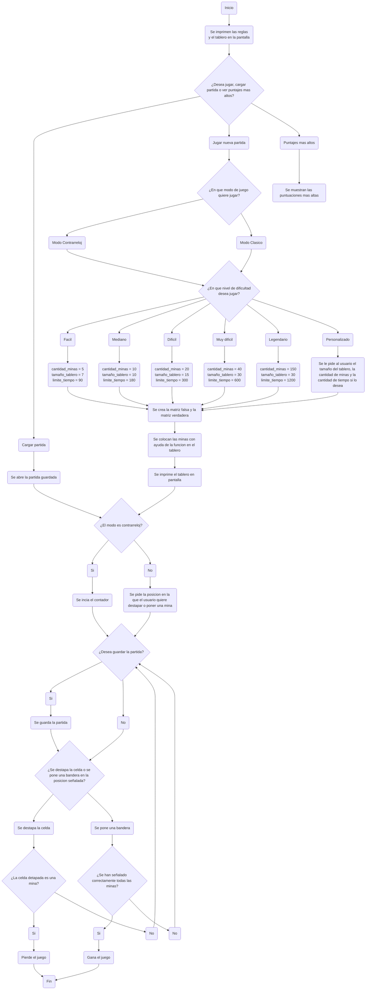

# PROYECTO BUSCAMINAS - GRUPO COD3

# Integrantes:

* David Santiago Hoyos Mateus

* Diego Garcés Torres

# Logo: 

[](https://postimg.cc/yWktQ7nf)

# Alternativa Seleccionada:
La alternativa elegida fue desarrollar un juego de Buscaminas, un juego clasico que consiste en señalar todas las posiciones en un tablero en las que hay minas. Este proyecto fue seleccionado porque ofrece la oportunidad de implementar varios aspectos técnicos clave, como la generación aleatoria de minas, la revelación de celdas y el cálculo preciso de los números adyacentes. Además, implica la creación de una interfaz gráfica que no solo debe ser intuitiva y fácil de usar, sino también visualmente atractiva para el usuario.

Un aspecto particularmente interesante de este proyecto es su potencial para expansión. Se pueden añadir diferentes niveles de dificultad, temporizadores y tableros personalizados, lo que permite convertir este desarrollo en un proyecto mucho más completo y sofisticado. Estas características adicionales no solo aumentan la complejidad del juego, sino que también permiten explorar diversas técnicas de programación y diseño, enriqueciendo aún más la experiencia de desarrollo.


# Lógica (Como se desarrolló el programa)
El objetivo del juego de Buscaminas en Python es descubrir todas las minas escondidas en un tablero o matriz. Si el jugador selecciona una casilla que tiene una mina, pierde el juego. Cada casilla vacía en el tablero muestra un número que indica cuántas minas están presentes en las ocho casillas adyacentes. Esta información es clave para ayudar al jugador a deducir la ubicación de las minas.

Para comenzar, se exponen las reglas del juego y el usuario escoge si cargar una partida guardada o jugar una nueva. Lo siguiente es escoger el modo de juego, si es clasico o contrareloj, junto con la dificultad (Fácil, Mediano, Difícil, Muy difícil, Legendario o Personalizado), dependiendo de esta se agregan mas o menos minas, tamaño y tiempo. Se crea la matriz falsa y la matriz real con las dimensiones especificas y dependiendo de la dificultad se colocan aleatoriamente un número fijo de minas en diferentes casillas del tablero. Las casillas que no contienen minas se inicializan como vacías. A continuación, se van poniendo las minas y "calculando" cuantas minas hay en las casillas adyacentes. Este conteo se muestra en la casilla correspondiente, proporcionando al jugador datos esenciales para tomar decisiones informadas.

Durante el juego, el jugador selecciona casillas basándose en la información que se revela. Además, tiene la opción de colocar banderas en las casillas donde sospecha que podrían haber minas. Esto le ayuda a evitar seleccionar accidentalmente esas casillas. Cuando el jugador selecciona una casilla con el número 0, el juego revela automáticamente todas las casillas adyacentes con el mismo número 0, extendiendo la revelación hasta encontrar un número mayor.

El jugador gana si coloca correctamente las banderas en todas las minas del tablero. La lógica del juego se maneja mediante un bucle principal que espera la entrada del jugador y actualiza el estado del tablero de acuerdo con las reglas establecidas. Tras cada movimiento, el juego verifica si todas las casillas con minas han sido señaldas correctamente para determinar si el jugador ha ganado. También se comprueba que no se haya revelado una casilla con una mina, lo cual resultaría en la derrota del jugador.

 #### Puntos importantes a tener en cuenta: 

 - Si la casilla destapada es 0, se destapan todas las casillas adyacentes que sean cero.
 - Se gana si se encuentran correctamente todas las minas.
 - Para que el juego funcione se crean dos matrices, la primera es la que se encuentra en la pantalla, es decir, la que puede ver el usuario. Y la segunda es aquella en la que va a estar toda la logica, los numeros, las minas, etc...
 - Cada vez que se ponga una mina aleatoriamente justo al iniciar el juego, a las casillas adyacentes se les suma 1.
 - Para evitar confusiones con el tablero y facilitar el juego al usuario, las columnas y las filas van a tener encabezados cada una, señalando el numero de fila o columna

# Actualizaciones
Se hicieron varias actualizaciones respecto al codigo anterior, agregandole y optimizando de una mejor manera el codigo algunas de las cuales son:

* Se agregaron los niveles de dificultades Fácil, Mediano, Difícil, Muy difícil, Legendario y Personalizado

* Se implementaron 2 modos de juego: contrarreloj y clásico

* Ahora se puede guardar y cargar una partida 

* Se mejoraron y optimizaron algunas funciones

* Se implementó un sistema de puntuaciones dependiendo del nivel de dificultad, la cantidad de minas correctamente señaladas y el tiempo final

# Funciones

#### Para que crear el programa se utilizaron ciertas funciones en las que esta toda la logica del programa, las cuales son: 

## Funcion matriz_falsa_funcion()
Funcion para crear la matriz de la pantalla con sus encabezados, es decir, a la que el usuario va a tener acceso, esta funcion solamente sirve para imprimirla por lo que no tiene ningun efecto en la logica detras de ella.

```python
# Función para generar y mostrar la matriz del tablero
def matriz_falsa_funcion():
    global matriz_falsa
    matriz_falsa = []

    # Encabezado de columnas ajustado para cualquier tamaño de tablero
    encabezado_columnas = "    " + "  ".join([f"{i:2}" for i in range(1, tamaño_tablero + 1)])
    matriz_falsa.append(encabezado_columnas)

    # Generar las filas del tablero
    for fila in range(tamaño_tablero):
        fila_matriz = [f"{fila + 1:2}"]  # Encabezado de fila ajustado
        for columna in range(tamaño_tablero):
            fila_matriz.append(espacio_sin_abrir)  # Espacio sin abrir
        matriz_falsa.append(fila_matriz)
```

## Funcion imprimir_tablero()
Funcion que imprime en pantalla en tablero correctamente con ayuda de la matriz_falsa generada en la funcion anterior

```python
def imprimir_tablero():
    # Imprimir encabezado de columnas
    print(matriz_falsa[0])

    # Imprimir filas con valores dentro de la cuadrícula
    for fila in range(1, tamaño_tablero + 1):
        # Dibujar línea horizontal superior ajustada
        print("   " + "-" * (3 * tamaño_tablero + tamaño_tablero + 1))

        # Dibujar la fila con valores
        fila_str = f"{fila:2} |"  # Encabezado de fila ajustado a dos dígitos
        for columna in range(1, tamaño_tablero + 1):
            fila_str += f" {matriz_falsa[fila][columna]} |"
        print(fila_str)

    # Dibujar la última línea inferior
    print("   " + "-" * (3 * tamaño_tablero + tamaño_tablero + 1))
```


## Funcion matriz_real_funcion()
Funcion para crear la segunda matriz (la de la logica) que es donde van a estar toda la informacion del programa y datos de cada casilla, en base a esta matriz se va a desarrollar todo el programa

```python
def matriz_real_funcion():
    global matriz_real
    matriz_real = []
    filas_matriz_real = []
    
    # Crear la matriz lógica con ceros
    for i in range(tamaño_tablero):
        for j in range(tamaño_tablero):
            filas_matriz_real.append(0) 
        matriz_real.append(filas_matriz_real)
        filas_matriz_real = []
```

## Funcion menu_terminal()

```python
def menu_terminal():
    global cantidad_minas, tamaño_tablero, lista_numeros, limite_tiempo, modo_de_juego, nombre_usuario 

    nombre_usuario = str(input("Por favor ingresa tu nombre o usuario = "))

    print("-----------------------------------------------Modo de Juego--------------------------------------------")
    print("Elige el modo de juego en el que quieres jugar: ")
    print("\n \
          -Contrarreloj (Escribe c)\n \
          -Clásico (Escribe cl)")
    while True:
        modo_de_juego = input("Por favor ingrese el modo de juego en el que desea jugar: ").lower()
        if modo_de_juego in ["c", "cl"]:
            break
        else:
            print("Por favor ingrese un valor válido.")

    print("-----------------------------------------------Dificultad-----------------------------------------------")
    print("Elige el nivel de dificultad en el que quieres jugar: ")
    print("\n \
          -Fácil (Escribe F)\n \
          -Mediano (Escribe M)\n \
          -Difícil (Escribe d)\n \
          -Muy difícil (Escribe md)\n \
          -Legendario (Escribe L)\n \
          -Personalizado (Escribe E)\n")
    while True:
        modo_de_dificultad = input("Ingresa el nivel de dificultad en el que quieres jugar: ").lower()
        if modo_de_dificultad == "f":
            cantidad_minas = 5
            tamaño_tablero = 7
            lista_numeros = [str(i) for i in range(1, tamaño_tablero + 1)]
            limite_tiempo = 90
            break
        elif modo_de_dificultad == "m":
            cantidad_minas = 10
            tamaño_tablero = 10
            lista_numeros = [str(i) for i in range(1, tamaño_tablero + 1)]
            limite_tiempo = 180
            break
        elif modo_de_dificultad == "d":
            cantidad_minas = 20
            tamaño_tablero = 15
            lista_numeros = [str(i) for i in range(1, tamaño_tablero + 1)]
            limite_tiempo = 300
            break
        elif modo_de_dificultad == "md":
            cantidad_minas = 40
            tamaño_tablero = 30
            lista_numeros = [str(i) for i in range(1, tamaño_tablero + 1)]
            limite_tiempo = 600
            break    
        elif modo_de_dificultad == "l":
            cantidad_minas = 150
            tamaño_tablero = 30
            lista_numeros = [str(i) for i in range(1, tamaño_tablero + 1)]
            limite_tiempo = 1200
            break
        elif modo_de_dificultad == "e":
            tamaño_tablero = int(input("Por favor ingrese el tamaño del tablero deseado: "))
            cantidad_minas = int(input("Por favor ingrese la cantidad de minas deseada: "))
            x = input("¿Quieres jugar en contrarreloj? (Responde con si o no): ").lower()
            if x == "si":
                while True:
                    try:
                        limite_tiempo = int(input("Por favor ingresa el límite de tiempo con el que quieres jugar (en segundos): "))
                        break
                    except ValueError:
                        print("Error: Por favor ingresa un número válido.")
            else:
                limite_tiempo = 0  # Sin límite de tiempo
            lista_numeros = [str(i) for i in range(1, tamaño_tablero + 1)]
            break
        else: 
            print("Por favor ingrese un valor válido.")
```

## Funcion colocar_minas()
Funcion para poner las minas en el tablero aleatoriamente, donde cada vez que se coloque una mina, se suma 1 en las casillas adyacentes, asi sucesivamente hasta poner las 10 minas.

```python
def colocar_minas():
    numero_minas = 0

    while numero_minas < cantidad_minas:
        fila_mina = random.randint(0, tamaño_tablero - 1) 
        columna_mina = random.randint(0, tamaño_tablero - 1)

        # Asegurarse de que no se coloque una mina en una posición ya ocupada
        if matriz_real[fila_mina][columna_mina] == "*":
            continue  # Saltar a la siguiente iteración si ya hay una mina aquí
        
        # Colocar la mina
        matriz_real[fila_mina][columna_mina] = "*" 
        
        # Actualizar las celdas adyacentes
        for i in range(fila_mina - 1, fila_mina + 2):
            for j in range(columna_mina - 1, columna_mina + 2):
                if 0 <= i < tamaño_tablero and 0 <= j < tamaño_tablero:
                    if matriz_real[i][j] != "*":
                        matriz_real[i][j] += 1
        
        numero_minas += 1
```

Para entender un poco mas esta funcion, primero hay que entender que la matriz de la logica al principio se ve asi (matriz 10x10):

[](https://postimg.cc/mcH2sQSW)

Luego de poner la primera mina aleatoriamente y recorrer las casillas adyacentes aumentando 1 se veria algo asi:

[](https://postimg.cc/K1b5LNRJ)

Del mismo modo funciona, sin importar si esta en las esquinas o en las paredes de la matriz

[](https://postimg.cc/gXpwtSbT)

[](https://postimg.cc/YGQPMSVS)

[](https://postimg.cc/Ty0GGCWS)

Ahora al poner la 2da mina aleatoriamente la matriz cambia a esto:

[](https://postimg.cc/34hsyp2G)

Y con una tercera a esto:

[](https://postimg.cc/Jyjw4KHm)

Al terminar de poner las 10 minas aleatoria la matriz logica se ve asi:

[](https://postimg.cc/fJH84PCp)

Evidentemente esto no se muestra al usuario ya que se ven todas las minas, esto unicamente es para la logica del juego, si se ve desde la perspectiva del jugador, el usuario veria el tablero de esta forma:

[](https://postimg.cc/VSqzNMhB)

## Funcion ingresar_verificar_posicion()
Funcion que pregunta por la posicion que el usuario desea y verifica que este correctamente escrita para trabajar con ella

```python
def ingresar_verificar_posicion():
     
    global lista_numeros
    print('\nIngrese una posición que desee destapar o señalar como una mina separándola con "-" de la siguiente manera M-fila-columna: ("M" para señalar mina o "D" para destapar, ej: D-9-1, M-10-8)\n \
          -Si desea guardar la partida presione g ')
    
    while True:
        usuario_posicion = input("Ingrese posición: ").upper()
        lista_usuario_posicion = usuario_posicion.split("-")
    
        # Validar el formato de entrada
        if len(lista_usuario_posicion) != 3:
            print("\nIngreso una posición incorrecta (no tiene 3 partes separadas por '-'), intente de nuevo.")
            continue

        accion, fila, columna = lista_usuario_posicion

        # Se verifica si el usuario quiere guardar la partida.    
        if usuario_posicion == "G-G-G":
            guardar_partida(nombre_archivo="archivos.json")
            return accion, fila, columna        
        
        if accion not in ["M", "D"]:
            print('\nIngreso una posición incorrecta (el primer carácter debe ser "M" o "D"), intente de nuevo.')
            continue 
        
        if fila not in lista_numeros or columna not in lista_numeros:
            print("\nIngreso una posición incorrecta (la fila o columna está fuera del rango), intente de nuevo.")
            continue
        
        # Convertir fila y columna a enteros
        fila = int(fila)
        columna = int(columna)
        
        # Verificar que la fila y columna estén dentro del tablero
        if not (1 <= fila <= tamaño_tablero) or not (1 <= columna <= tamaño_tablero):
            print("\nIngreso una posición incorrecta (la fila o columna está fuera del tablero), intente de nuevo.")
            continue
        
        return accion, fila, columna
```

## Funcion casillas_adyacentes()
Funcion para que al destapar una casilla con 0, se destapen sus casillas adyacentes.

```python
def casillas_adyacentes(fila_escogida, columna_escogida):
    direcciones = [(-1, -1), (-1, 0), (-1, 1),(0, -1),(0, 1),(1, -1),(1, 0),(1, 1)]

    # Verificar si la posición ya fue destapada
    if matriz_falsa[fila_escogida][columna_escogida] != espacio_sin_abrir:
        return

    # Si la celda en la matriz real es 0, destapar las adyacentes
    if matriz_real[fila_escogida-1][columna_escogida-1] == 0:
        matriz_falsa[fila_escogida][columna_escogida] = "0" 
        
        for direccion in direcciones:
            fila_adicional = fila_escogida + direccion[0]
            columna_adicional = columna_escogida + direccion[1]

            if 1 <= fila_adicional <= tamaño_tablero and 1 <= columna_adicional <= tamaño_tablero:
                if matriz_falsa[fila_adicional][columna_adicional] == espacio_sin_abrir:
                    if matriz_real[fila_adicional - 1][columna_adicional - 1] == 0:
                        casillas_adyacentes(fila_adicional, columna_adicional)
                    else:
                        matriz_falsa[fila_adicional][columna_adicional] = f"{matriz_real[fila_adicional - 1][columna_adicional - 1]}"
    
    else:
        matriz_falsa[fila_escogida][columna_escogida] = f" {matriz_real[fila_escogida-1][columna_escogida-1]} "
```

## Funcion destapar_celda()
Funcion que sirve para destapar una casilla o señalar una mina en una posicion (Si es mina, el usuario pierde)

```python
def destapar_celda(bandera_o_destapar, fila_escogida, columna_escogida):
    global minas_correctamente_señaladas
    global lista_minas_señaladas
    global lista_banderas

    fila_idx = fila_escogida - 1
    columna_idx = columna_escogida - 1
    lista_banderas = {}

    if bandera_o_destapar == "M": 
        matriz_falsa[fila_escogida][columna_escogida] = "\U0001F6A9"
        if matriz_real[fila_idx][columna_idx] == "*" and (fila_escogida, columna_escogida) not in lista_minas_señaladas:
            minas_correctamente_señaladas += 1
            lista_minas_señaladas.append((fila_escogida, columna_escogida))
        
            if minas_correctamente_señaladas == cantidad_minas:
                imprimir_tablero()
                print("\n--------------------------------------------------------------------------------------------------------")
                print("------------------------HAS SEÑALADO TODAS LAS MINAS CORRECTAMENTE! HAS GANADO!-------------------------")
                print("--------------------------------------------------------------------------------------------------------")
                return True 
    
    elif bandera_o_destapar == "D":
        casillas_adyacentes(fila_escogida, columna_escogida)
        matriz_falsa[fila_escogida][columna_escogida] = f"{matriz_real[fila_idx][columna_idx]}"
        
        if matriz_real[fila_idx][columna_idx] == "*":
            matriz_falsa[fila_escogida][columna_escogida] = "\U0001F4A3"
            imprimir_tablero()
            print("\n--------------------------------------------------------------------------------------------------------")
            print("-----------------------------------HAS PISADO UNA MINA! GAME OVER!----------------------------------------")
            print("----------------------------------------------------------------------------------------------------------")
            return True

    # Imprimir la matriz actualizada
    imprimir_tablero()

    return False  # El juego continúa
```

## Funcion transcurso_juego()

```python
def transcurso_juego():
    global modo_de_juego, limite_tiempo, tiempo_final, tiempo_restante
    # Inicializar el tiempo solo si es modo "c" (con límite de tiempo)
    if modo_de_juego == "c":
        inicio = time.time()
    else:
        inicio = None  # No se usa en modo clásico
    
    # Ciclo principal del juego
    while True:
        #Se verifica si el usuario quiere guardar la partida
        bandera_o_destapar, fila_escogida, columna_escogida = ingresar_verificar_posicion()
        if bandera_o_destapar == "G" and fila_escogida == "G" and columna_escogida == "G":
            tiempo_restante = limite_tiempo - int(tiempoTranscurrido)
            print("\n-----------------------------------------------------------------------------------------")
            print("-----------------------------------PARTIDA GUARDADA----------------------------------------")
            print("-------------------------------------------------------------------------------------------")
            break

        # Llamar a la función para destapar la celda o marcar una mina
        Terminar = destapar_celda(bandera_o_destapar, fila_escogida, columna_escogida)
        # Verificar si el juego ha terminado (ganar o pisar una mina)
        if Terminar == True:
            break
        
        # Si el modo de juego es contrarreloj, verificar el tiempo transcurrido
        if modo_de_juego == "c":
            tiempoTranscurrido = time.time() - inicio
            if tiempoTranscurrido >= limite_tiempo:
                imprimir_tablero()
                print("\n--------------------------------------------------------------------------------------------------------")
                print("-----------------------------------FIN DEL TIEMPO! GAME OVER!--------------------------------------------")
                print("--------------------------------------------------------------------------------------------------------")
                tiempo_final = 1
                break
            else:
                #Mostrar el tiempo restante
                tiempo_restante = limite_tiempo - int(tiempoTranscurrido)
                tiempo_final = tiempo_restante
                print(f"Tiempo restante: {tiempo_restante} segundos")
```

## Funcion puntuaciones()

```python
def puntuaciones():
    global tiempo_final,minas_correctamente_señaladas, puntaje, modo_de_dificultad, modo_de_juego
    if modo_de_juego.lower() == "c":
        valor_nivel = 1
        if modo_de_dificultad == "f":
            valor_nivel = 1
        elif modo_de_dificultad == "m":
            valor_nivel = 10 
        elif modo_de_dificultad == "d":
            valor_nivel = 100
        elif modo_de_dificultad == "md":
            valor_nivel = 500    
        elif modo_de_dificultad == "l":
            valor_nivel = 1000
        elif modo_de_dificultad == "e":
            valor_nivel = cantidad_minas * (1000/150) 
        
        puntaje = ((minas_correctamente_señaladas*500)*valor_nivel) +10/(1/tiempo_final)

        print(f"El nivel de dificultad fue {modo_de_dificultad}\n \
            La cantidad de minas señaladas correctamente es {minas_correctamente_señaladas}\n \
            Felicidades tu puntaje fue {puntaje}")
    elif modo_de_juego.lower() == "cl":
        puntaje = minas_correctamente_señaladas*500
        print(f"El nivel de dificultad fue {modo_de_dificultad}\n \
            La cantidad de minas señaladas correctamente es {minas_correctamente_señaladas}\n \
            Felicidades tu puntaje fue {puntaje}")
```

## Funcion guardar_partida()

```python
def guardar_partida(nombre_archivo = "partida_guardada.json"):
    global matriz_real, lista_minas_señaladas, matriz_falsa, modo_de_dificultad, modo_de_juego, tiempo_restante
    datos_partida = {
        "matriz_real": matriz_real,
        "tablero" : matriz_falsa,
        "banderas" : lista_minas_señaladas,
        "modo de dificultad" : modo_de_dificultad,
        "modo de juego" : modo_de_juego,
        "tiempo restante": tiempo_restante
    }

    with open(nombre_archivo, "w") as archivo:
        json.dump(datos_partida, archivo)
    return datos_partida
```


## Funcion cargar_partida()

```python
def cargar_partida(nombre_archivo="partida_guardada.json"):
    try:
        with open(nombre_archivo, "r") as archivo:
            datos_partida = json.load(archivo)  

        print(f"Partida cargada desde {nombre_archivo}")
        return datos_partida
    except FileNotFoundError:
        print(f"No se encontro ninguna partida guardada.")
        return None
```

## Funcion crear_partida_guardada()

```python
def crear_partida_guardada():
    global matriz_real, lista_minas_señaladas, matriz_falsa, modo_de_dificultad, modo_de_juego, tiempo_restante,limite_tiempo, tamaño_tablero, lista_numeros
    datos_partida = {}
    datos_partida = cargar_partida()
    print(datos_partida)
    tamaño_tablero = datos_partida["tamaño tablero"]
    lista_minas_señaladas = datos_partida["banderas"]
    matriz_falsa = datos_partida["tablero"]
    modo_de_dificultad = datos_partida["modo de dificultad"]
    modo_de_juego = datos_partida["modo de juego"]
    tiempo_restante = datos_partida["tiempo restante"]
    matriz_real = datos_partida["matriz_real"]

    print("-------------------------------------------------------------------------------------------------------")
    print("--------------------------------PARTIDA CARGADA CORRECTAMENTE------------------------------------------")
    print("-------------------------------------------------------------------------------------------------------")

    lista_numeros = [str(i) for i in range(1, tamaño_tablero + 1)]    
        
    imprimir_tablero()
    inicio = time.time()
    while True:
        #Se verifica si el usuario quiere guardar la partida
        bandera_o_destapar, fila_escogida, columna_escogida = ingresar_verificar_posicion()
        if bandera_o_destapar == "G" and fila_escogida == "G" and columna_escogida == "G":
            print("\n-----------------------------------------------------------------------------------------")
            print("-----------------------------------PARTIDA GUARDADA----------------------------------------")
            print("-------------------------------------------------------------------------------------------")
            break

        # Llamar a la función para destapar la celda o marcar una mina
        Terminar = destapar_celda(bandera_o_destapar, fila_escogida, columna_escogida)
        # Verificar si el juego ha terminado (ganar o pisar una mina)
        if Terminar == True:
            break
        
        # Si el modo de juego es contrarreloj, verificar el tiempo transcurrido
        if modo_de_juego == "c":
            limite_tiempo = tiempo_restante
            tiempoTranscurrido = time.time() - inicio
            if tiempoTranscurrido >= limite_tiempo:
                imprimir_tablero()
                print("\n--------------------------------------------------------------------------------------------------------")
                print("-----------------------------------FIN DEL TIEMPO! GAME OVER!--------------------------------------------")
                print("--------------------------------------------------------------------------------------------------------")
                tiempo_final = 1
                break
            else:
                #Mostrar el tiempo restante
                tiempo_restante = limite_tiempo - int(tiempoTranscurrido)
                tiempo_final = tiempo_restante
                print(f"Tiempo restante: {tiempo_restante} segundos")
    puntuaciones()
```

## Funcion menu_principal()

```python
def menu_principal():
    global lista_minas_señaladas
    print("--------------------------------------------------------------------------------------------------------")
    print("-----------------------------------------------BUSCAMINAS-----------------------------------------------")
    print("--------------------------------------------------------------------------------------------------------")
    print('\n \
    -El juego consiste en señalar todas las minas\n \
    -El número en una casilla indica el número de minas alrededor (en todas sus casillas adyacentes)\n \
    -Si destapas una casilla que es mina pierdes el juego\n \
    -Las minas se pueden señalar o marcar con "banderas"\n')

    print("------------------------------------------------JUGAR(Presiona J)----------------------------------------")
    print("------------------------------------------------CARGAR PARTIDA(Presiona C)-------------------------------")
    print("------------------------------------------------PUNTAJES MAS ALTOS(Presiona P)---------------------------")    
    entrada_usuario = str(input("Por favor ingrese su respuesta: "))
    if entrada_usuario not in ["j", "c", "p"]:
        while entrada_usuario not in ["j", "c", "p"]:
            print("Por favor ingresa un valor valido.")
            entrada_usuario = str(input("Por favor ingrese su respuesta: "))
    if entrada_usuario.lower() == "j":
        print("¿Quieres jugar en la terminal de Python(presiona t) o quieres jugar en una ventana emergente(Presiona v)?")
        while True:
            x = str(input("Por favor ingrese su respuesta"))
            if x.lower() in ["t", "v"]:
                break
            else: 
                print("Por favor ingresar un valor valido.")
        if x.lower() == "t":
            jugar_terminal()
        elif x.lower() == "v":
            matriz_falsa_funcion()
            matriz_real_funcion()
            colocar_minas()
            pygames()
    elif entrada_usuario.lower() == "c":
        try:
            crear_partida_guardada()
        except TypeError:
            print("Primero debes guardar una partida")
    elif entrada_usuario.lower() == "p":
        puntuaciones_mas_altas()
        imprimir_puntajes()
```

## Funcion jugar_terminal()

```python
def jugar_terminal():
    # Inicializar las variables con las que se gana el juego
    minas_correctamente_señaladas = 0
    lista_minas_señaladas = []
    
    # Crear la matriz falsa y la matriz lógica
    menu_terminal()
    matriz_falsa_funcion()
    matriz_real_funcion()
    colocar_minas()
    imprimir_tablero()
    
    # Iniciar el ciclo principal del juego
    transcurso_juego()
    puntuaciones()
    
    # Verificar si el juego terminó por señalamiento correcto de todas las minas
    if minas_correctamente_señaladas == cantidad_minas:
        print("¡Felicidades! Has ganado el juego.")
    else:
        print("Gracias por jugar.")
```
## Funcion puntuaciones_mas_altas()

```python
def puntuaciones_mas_altas():
    global nombre_usuario, mayores_puntuaciones_clasico, mayores_puntuaciones_contrarreloj, modo_de_dificultad
    if modo_de_juego == "c":
        mayores_puntuaciones_contrarreloj = {
            "1" : {
                "nombre_usuario": "0",
                "modo_de_dificultad": "0", 
                "puntaje": 0
            },
            "2":{"nombre_usuario": "0",
                "modo_de_dificultad": "0", 
                "puntaje" : 0},
            "3":{"nombre_usuario": "0",
                "modo_de_dificultad": "0", 
                "puntaje" : 0},
        }
    elif modo_de_juego == "cl":
                mayores_puntuaciones_clasico = {
            "1":{
                "nombre_usuario": "0",
                "modo_de_dificultad" : "0", 
                "puntaje" : 0
            },
            "2":{ 
                "nombre_usuario" : "0",
                "modo_de_dificultad" : "0", 
                "puntaje" : 0},
            "3":{  
                "nombre_usuario" : "0",
                "modo_de_dificultad" : "0", 
                "puntaje" : 0}
        }
    if modo_de_juego == "c":
        if puntaje > mayores_puntuaciones_contrarreloj["1"]["puntaje"]:
            mayores_puntuaciones_contrarreloj["3"] = mayores_puntuaciones_contrarreloj["2"]
            mayores_puntuaciones_contrarreloj["2"] = mayores_puntuaciones_contrarreloj["1"]
            mayores_puntuaciones_contrarreloj["1"]["puntaje"] = puntaje
            mayores_puntuaciones_contrarreloj["1"]["modo_de_dificultad"] = modo_de_dificultad
            mayores_puntuaciones_contrarreloj["1"]["nombre_usuario"] = nombre_usuario
        elif mayores_puntuaciones_contrarreloj["2"]["puntaje"] < puntaje < mayores_puntuaciones_contrarreloj["1"]["puntaje"]:
            mayores_puntuaciones_contrarreloj["3"] = mayores_puntuaciones_contrarreloj["2"]
            mayores_puntuaciones_contrarreloj["2"]["puntaje"] = puntaje
            mayores_puntuaciones_contrarreloj["2"]["modo_de_dificultad"] = modo_de_dificultad
            mayores_puntuaciones_contrarreloj["2"]["nombre_usuario"] = nombre_usuario
        elif mayores_puntuaciones_contrarreloj["3"]["puntaje"] < puntaje < mayores_puntuaciones_contrarreloj["2"]["puntaje"]:
            mayores_puntuaciones_contrarreloj["3"]["puntaje"] = puntaje
            mayores_puntuaciones_contrarreloj["3"]["modo_de_dificultad"] = modo_de_dificultad
            mayores_puntuaciones_contrarreloj["3"]["nombre_usuario"] = nombre_usuario

    if modo_de_juego == "cl":
        if puntaje > mayores_puntuaciones_clasico["1"]["puntaje"]:
            mayores_puntuaciones_clasico["3"] = mayores_puntuaciones_clasico["2"]
            mayores_puntuaciones_clasico["2"] = mayores_puntuaciones_clasico["1"]
            mayores_puntuaciones_clasico["1"]["puntaje"] = puntaje
            mayores_puntuaciones_clasico["1"]["modo_de_dificultad"] = modo_de_dificultad
            mayores_puntuaciones_clasico["1"]["nombre_usuario"] = nombre_usuario
        elif mayores_puntuaciones_clasico["2"]["puntaje"] < puntaje < mayores_puntuaciones_clasico["1"]["puntaje"]:
            mayores_puntuaciones_clasico["3"] = mayores_puntuaciones_clasico["2"]
            mayores_puntuaciones_clasico["2"]["puntaje"] = puntaje
            mayores_puntuaciones_clasico["2"]["modo_de_dificultad"] = modo_de_dificultad
            mayores_puntuaciones_clasico["2"]["nombre_usuario"] = nombre_usuario
        elif mayores_puntuaciones_clasico["3"]["puntaje"] < puntaje < mayores_puntuaciones_clasico["2"]["puntaje"]:
            mayores_puntuaciones_clasico["3"]["puntaje"] = puntaje
            mayores_puntuaciones_clasico["3"]["modo_de_dificultad"] = modo_de_dificultad
            mayores_puntuaciones_clasico["3"]["nombre_usuario"] = nombre_usuario

    with open("puntuaciones_contrarreloj.json", "w") as writeFile:
        json.dump(mayores_puntuaciones_contrarreloj, writeFile)

    with open("puntuaciones_clasico.json", "w") as writeFile:
        json.dump(mayores_puntuaciones_clasico, writeFile)
```

## Funcion imprimir_puntajes()

```python
def imprimir_puntajes():
    print("Quieres ver los puntajes del modo contrarreloj(presiona c) o del modo clasico(presiona cl)?")
    with open("puntuaciones_contrarreloj.json", "r") as readFile:
        puntuaciones_contrarreloj: dict = json.load(readFile)
    with open("puntuaciones_clasico.json", "r") as readFile:
        puntuaciones_clasico: dict = json.load(readFile)  
    while True:
        x = str(input("Por favor ingrese la respuesta: "))
        if x.lower() in ["c", "cl"]:
            break
        else:
            print("Por favor ingrese un valor valido.")
    print("--------------------------------------------------------------------------------------------------------")
    print("------------------------------------------MAYORES PUNTUACIONES------------------------------------------")
    print("--------------------------------------------------------------------------------------------------------")
    if x.lower() == "c":
        print("|NOMBRE USUARIO       |MODO DE DIFICULTAD        |PUNTAJE")
        print("------------------------------------------------------------------")
        for key in puntuaciones_contrarreloj:
            puntaje = puntuaciones_contrarreloj[key].get("puntaje", "N/A")
            modo_de_dificultad = puntuaciones_contrarreloj[key].get("modo_de_dificultad", "N/A")
            nombre_usuario = puntuaciones_contrarreloj[key].get("nombre_usuario", "N/A")
            print(f"|{nombre_usuario}                    |{modo_de_dificultad}                         |{puntaje}       ")
            print("------------------------------------------------------------------")

    elif x.lower() == "cl":
        print("|NOMBRE USUARIO       |MODO DE DIFICULTAD        |PUNTAJE")
        print("------------------------------------------------------------------")
        for key in puntuaciones_clasico:
            puntaje = puntuaciones_clasico[key].get("puntaje")
            modo_de_dificultad = puntuaciones_clasico[key].get("modo_de_dificultad")
            nombre_usuario = puntuaciones_clasico[key].get("nombre_usuario")
            print(f"|{nombre_usuario}                    |{modo_de_dificultad}                         |{puntaje}       ")
            print("------------------------------------------------------------------")
```

### Algoritmo

