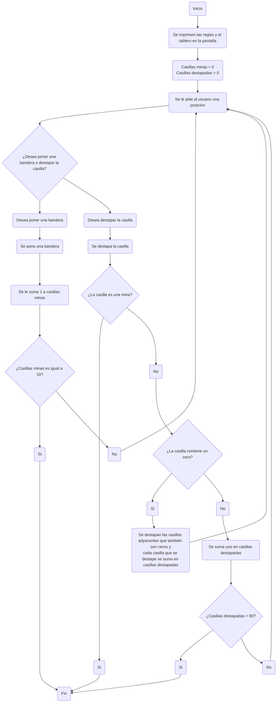

# PROYECTO BUSCAMINAS - GRUPO COD3

# Integrantes:

* David Santiago Hoyos Mateus

* Diego Garcés Torres

# Logo: 

[](https://postimg.cc/yWktQ7nf)

# Alternativa Seleccionada:
La alternativa elegida fue desarrollar un juego de Buscaminas, un juego clasico que consiste en destapar todas las casillas vacías de un tablero sin revelar aquellas que contienen minas. Este proyecto fue seleccionado porque ofrece la oportunidad de implementar varios aspectos técnicos clave, como la generación aleatoria de minas, la revelación de celdas y el cálculo preciso de los números adyacentes. Además, implica la creación de una interfaz gráfica que no solo debe ser intuitiva y fácil de usar, sino también visualmente atractiva para el usuario.

Un aspecto particularmente interesante de este proyecto es su potencial para expansión. Se pueden añadir diferentes niveles de dificultad, temporizadores y tableros personalizados, lo que permite convertir este desarrollo en un proyecto mucho más completo y sofisticado. Estas características adicionales no solo aumentan la complejidad del juego, sino que también permiten explorar diversas técnicas de programación y diseño, enriqueciendo aún más la experiencia de desarrollo.


## Lógica (Como se va a desarrollar el programa)
El objetivo del juego de Buscaminas en Python es descubrir todas las casillas del tablero que no contienen minas. Si el jugador selecciona una casilla que tiene una mina, pierde el juego. Cada casilla vacía en el tablero muestra un número que indica cuántas minas están presentes en las ocho casillas adyacentes. Esta información es clave para ayudar al jugador a deducir la ubicación de las minas.

Para comenzar, se crea un tablero con dimensiones específicas, por ejemplo, 10x10. Se colocan aleatoriamente un número fijo de minas en diferentes casillas del tablero. Las casillas que no contienen minas se inicializan como vacías. A continuación, para cada casilla vacía, se calcula cuántas minas hay en las casillas adyacentes. Este conteo se muestra en la casilla correspondiente, proporcionando al jugador datos esenciales para tomar decisiones informadas.

Durante el juego, el jugador selecciona casillas basándose en la información que se revela. Además, tiene la opción de colocar banderas en las casillas donde sospecha que podrían haber minas. Esto le ayuda a evitar seleccionar accidentalmente esas casillas. Cuando el jugador selecciona una casilla con el número 0, el juego revela automáticamente todas las casillas adyacentes con el mismo número 0, extendiendo la revelación hasta encontrar un número mayor.

El jugador gana si descubre todas las casillas que no contienen minas o si coloca banderas en todas las minas del tablero. La lógica del juego se maneja mediante un bucle principal que espera la entrada del jugador y actualiza el estado del tablero de acuerdo con las reglas establecidas. Tras cada movimiento, el juego verifica si todas las casillas sin minas han sido descubiertas para determinar si el jugador ha ganado. También se comprueba que no se haya revelado una casilla con una mina, lo cual resultaría en la derrota del jugador.

 #### Puntos importantes a tener en cuenta: 

 - Si la casilla destapada es 0, se destapan todas las casillas adyacentes que sean cero.
 - Se gana si se destapan 90 casillas o 10 minas correctas encontradas.
 - Para que el juego funcione se crean dos matrices, la primera es la que se encuentra en la pantalla, es decir, la que puede ver el usuario. Y la segunda es aquella en la que va a estar toda la logica, los numeros, las minas, etc...
 - Cada vez que se ponga una mina a las casillas adyacentes se les suma 1.
 - Para facilitar el acceso al usuario de las casillas, las columnas van a estar representadas por numeros y las filas por letras.


### Funciones preliminares

Para que el programa funcione se crearon seis funciones principales, las cuales son: 

- Funcion para crear la matriz de la pantalla, es decir, a la que el usuario va a tener acceso. 
- Funcion para crear la segunda matriz(la de la logica) que es donde van a estar los datos de cada casilla.
- Funcion para poner las minas, tomando en cuenta que cada vez que se ponga una se le suma 1 a las casillas adyacentes. 
- Funcion para destapar todas las casillas adyacentes que tienen 0 cuando se destapa una casilla que tenga 0. 
- Funcion que destapa una casilla en una posicion(Si es mina, el usuario pierde)
- Funcion para colocar una bandera en la posicion. 

### Programa preliminar

```python
#Aqui va el programa preliminar
```

### Explicacion del programa

*Basicamente...

### Algoritmo preliminar


