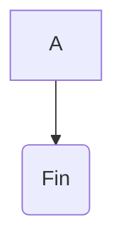

# Avance-Proyecto

## Grupo: CoD3

### Integrantes:

ºDavid Santiago Hoyos Mateus

ºDiego Garcés Torres

### Alternativa Seleccionada:

*La alternativa que se selecciono fue la de hacer un buscaminas ya que...

### Lógica (Como se va a desarrollar el programa)
*Hay ciertas cosas que hay que tener en cuenta en la logica interna del programa...

### Funciones preliminares

*En el programa hay 6 funciones primordiales las cuales son:

### Programa preliminar

```python
#Aqui va el programa preliminar
```

### Algoritmo preliminar


